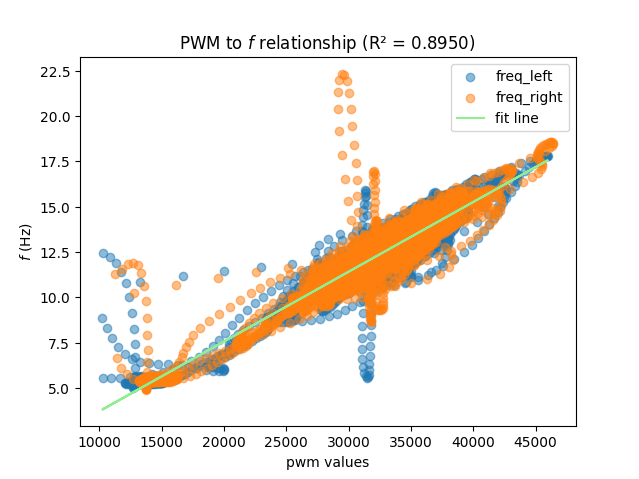
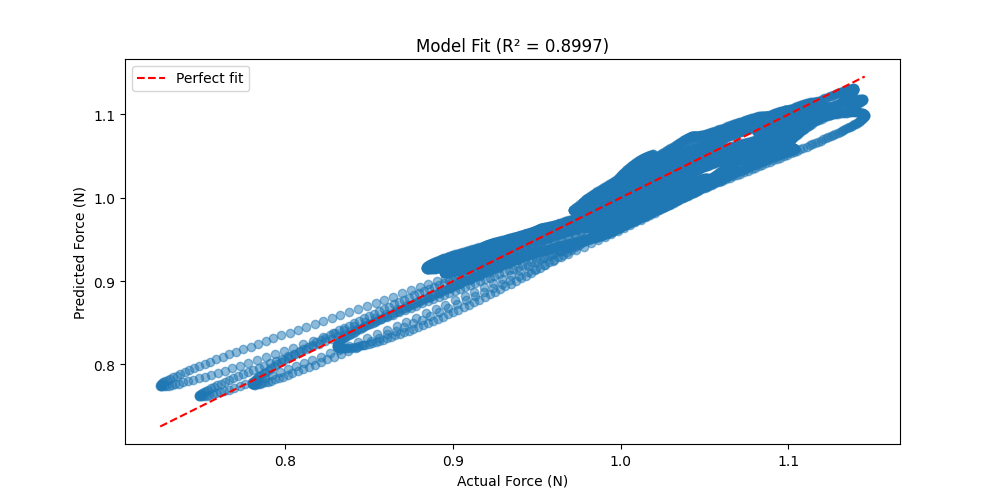
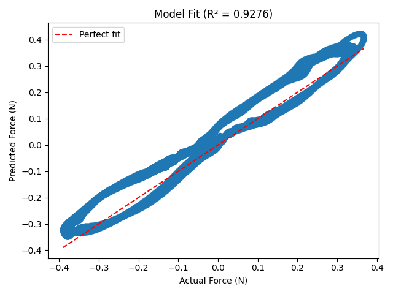

# flapper-dynamic-model

A dynamic model for the flapper+ flapping wing micro air vehicle, complete with controller, state estimation and power distribution.


# flapper dynamic model

## Equations of Motion "template"

Due to the nice symmetry of the flapper all the product moments of inertia are zero kg/m².  Thus, the mass moment of inertia matrix $\mathcal{I}$ is diagonal. In fact, $I_{xy} = I_{yz} = 0$ as the flapper is perfectly symmetric about this planes, and $I_{xz} \sim 0$, as along the $xz$ plane the battery is slightly asymmetric, but the difference is really close to the axes and thus negligible.
$$
\mathcal{I} =
\begin{bmatrix}
I_{xx} & I_{xy} & I_{xz} \\
I_{yx} & I_{yy} & I_{yz} \\
I_{zx} & I_{zy} & I_{zz}
\end{bmatrix} = \begin{bmatrix}
I_{xx} & 0 & 0 \\
0 & I_{yy} & 0 \\
0 & 0 & I_{zz}
\end{bmatrix}
$$

Given the moment of inertia matrix is diagonal, this reduces the couplings between each of the 6 equations of motion. The equations of motions, with the applied forces $X, Y, Z$ and the applied moments $L, M, N$ can be written in scalar form in the following way:

$$
\begin{align}
\dot{u} &= -(wq - vr) + \frac{X}{m} - g \sin \theta \\
\dot{v} &= -(ur - wp) + \frac{Y}{m} + g \cos \theta \sin \phi \\
\dot{w} &= -(vp - uq) + \frac{Z}{m} + g \cos \theta \cos \phi \\
I_{xx}\dot{p} &= (I_{yy} - I_{zz})qr + L \\
I_{yy}\dot{q} &= (I_{zz} - I_{xx})pr + M \\
I_{zz}\dot{r} &= (I_{xx} - I_{yy})pq + N \\
\end{align}
$$

While the relationship between the rates and the euler angles is given by a multiplication with the rotation matrix defining the intrinsic rotations from body axes to euler angles. 

$$
\begin{align}
\dot{\phi} &= p + q \sin \phi \tan \theta + r \cos \phi \tan \theta \\
\dot{\theta} &= q \cos \phi - r \phi \\
\dot{\psi} &= r
\end{align}
$$

## Model from "A minimal longitudinal dynamic model of a taillless ... " by Matej Karásek

The model presented is purely longitudinal. and has the following applied forces and moments.

$$
\begin{aligned}
X &= - (f_L + f_R)\:k_{xu}\:(u - l_z \;q + \dot{l_d}) \\
Y &= \varnothing \\
Z &= - (f_L + f_R) \:k_{zw}\:(w - l_d \: q) \\
L &= \varnothing\\
M &= X \cdot l_z + Z \cdot l_d\\
N &= \varnothing\\
\end{aligned}
$$

## Building up from the previous model

The same philosophy of defining the drag force as linearly proportional to the flapping frequency and the body axes velocity in the direction the drag is acting. To apply these concepts, few different variables are introduced.

Firstly, the dihedral angle $\Gamma$ is defined as positive for $\theta > 0$, and thus pitching backwards, similarly, $\Gamma <0$ brings to negative pitch, and thus going forward. Please note the $\theta >0$ or $\theta< 0$ is only valid if the drone is considered to be hovering initially.

Secondly, the yaw angle $\Lambda$


Moreover, the angle of attack of the wing: this can change due to a change in dihedral, as a change in dihedral angle will lead to the top of the wing moving with respect to the fixed end which is constrained by the yaw servo. The angle of attack is also what is changed in order for yaw to happen, the servo motor changes the angle of attacks in each wing oppositely (with opposite signs). The angle of attack is defined according to the aerospace standard, negative if the wing pitches down (e.g. in a longitudinal backwards maneuvre), and positive if the wing pitches upwards.


The definition of the angle of attack is different for each wing, due to the servo motor imposing different (opposite) conditions on each wing.

$$
\begin{align}
\alpha_L &= \arcsin\Big(\frac{-l_w\sin\Gamma + l_y\sin\Lambda}{l_k}\Big)\\
\alpha_R &= \arcsin\Big(\frac{-l_w\sin\Gamma - l_y\sin\Lambda}{l_k}\Big) \\
\end{align}
$$

Let's define some variables for simplicity:
$$
\begin{aligned}
Z_L & =f_L (w - l_w \sin(\Gamma)q + l_w \cos(\Gamma)p) \\
Z_R &= f_R (w - l_w \sin(\Gamma)q - l_w \cos(\Gamma)p) \\
l_d &= l_w \sin(\Gamma) \\

\end{aligned}
$$

Which becomes: (use $\Lambda$ for yaw angle actuator)

$$
\begin{aligned}
X &= -k_{xu} (f_L + f_R) (u - l_z q + l_w\dot{\Gamma}\sin{\Gamma}) - T_L\sin(\alpha_L) - T_R\sin(\alpha_R)\\
Y &= -k_{yv}(f_L + f_R)(v + l_z \:p)\\
Z &= -k_{zw} \left[Z_L + Z_R\right] - (T_R\cos(\alpha_R) + T_L\cos(\alpha_L))\\
\end{aligned}
$$


$$
\begin{aligned}
L &= -k_{zw} \left[Z_L - Z_R\right] l_w \cos(\Gamma)+ Y\:l_z + l_W\sin(\Gamma)(T_L\cos(\alpha_L) - T_R\cos(\alpha_R))\\
M &= -k_{xu} (f_L + f_R) (u - l_z q + l_w\dot{\Gamma}\sin{\Gamma}) \cdot l_z +(T_L\sin(\alpha_L) + T_R\sin(\alpha_R)) \cdot l_z-k_{zw} \left[Z_L + Z_R\right] \cdot l_d + (T_R\cos(\alpha_R) + T_L\cos(\alpha_L)) \cdot l_w\sin(\Gamma)\\
N &= -k_N \left[(f_L + f_R)Rr + (f_L - f_R)u + (f_L + f_R)\Gamma v\right] + l_w\cos(\Gamma)(T_R\sin(\alpha_R) - T_L\cos(\alpha_L))
\end{aligned}
$$


$\Lambda > 0$ expect $r<0$ 

## Regressions on the forces

### PWM to Frequency



Yields the following terminal output.

```
======================================================================
                                                                      
Regression for pwm to f relationship
Using a linear model for the thrust; f = c1 * pwm + c2
Found dataset: flight_001_processed.csv
Found dataset: flight_002_processed.csv
The R^2 regression score for the regression from pwm to f is 0.8950
Linear regression parameters are: c1 = 0.000385, c2 = -0.132501
                                                                      
======================================================================
```


### **Hovering and Climbing**




Yields the following terminal output.

```
======================================================================
                                                                      
Regression for vertical ascend / descent
The R^2 regression score for the vertical regression is 0.8997
Linear regression parameters are: k_zw = 0.003909, c1 = 0.039983, c2 = -1.020232
                                                                      
======================================================================
```


### **Longitudinal Regression**


vertical

Yields the following terminal output.

```
======================================================================
                                                                      
Regression for longitudinal maneuvres
The R^2 regression score for the longitudinal regression is 0.9276
Linear regression parameters are: k_zx = 0.016908
                                                                      
======================================================================
```
